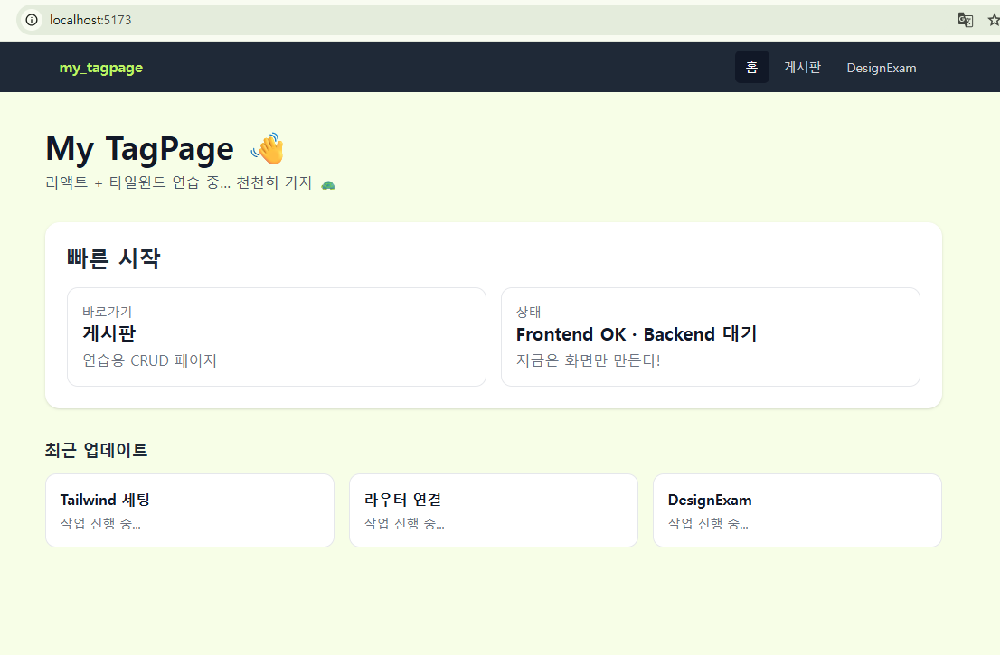
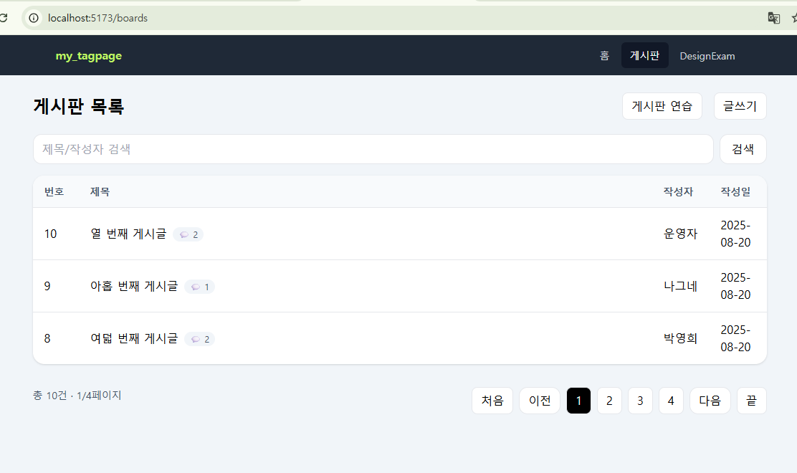
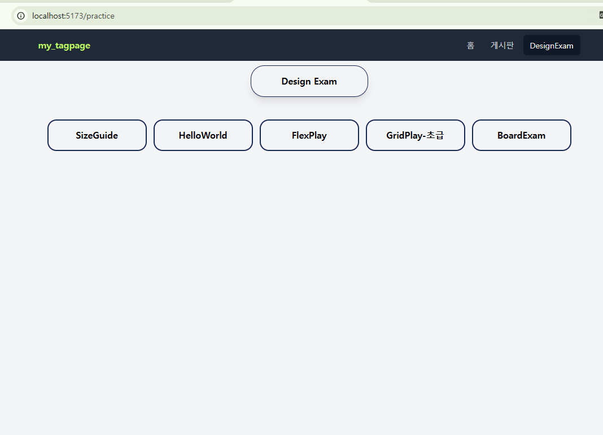

# 📘 My TagPage
React + Spring Boot CRUD 학습 프로젝트  

> React + Spring Boot를 연결하여 CRUD(등록/조회/수정/삭제) 기능을 구현한 학습용 프로젝트입니다.  
> 학습 블로그 용도로 제작했습니다.
>

---

## 🚀 기술 스택
- **Frontend**: React (Vite), React Router, fetch API  
- **Backend**: Spring Boot 3, Spring Data JPA, H2 Database  
- **Build & Run**: Gradle, npm  
- **DB**: H2 (in-memory → `update` 모드로 데이터 유지)

---

## 📂 프로젝트 구조
<pre>
my_tagpage/
├─ backend/mtpexam
│ ├─ controller # REST API 컨트롤러
│ ├─ entity # JPA 엔티티 (Board, Comment)
│ ├─ repository # JPA Repository
│ └─ service # 서비스 레이어
│
└─ frontend/
├─ src/assets/pages # BoardList, BoardDetail, BoardsNew
├─ src/assets/components # 재사용 컴포넌트
└─ .env # VITE_API_BASE_URL 설정
</pre>

---

## ✨ 구현 기능

### 📌 게시글 CRUD
- [x] 게시글 등록 (POST)  
- [x] 게시글 조회 (GET, 페이징/정렬 지원)  
- [x] 게시글 상세 조회 (GET by id)  
- [x] 게시글 수정 (PATCH)  
- [x] 게시글 삭제 (DELETE)  

### 📌 댓글 CRUD
- [ ] 댓글 등록 (POST)  
- [x] 댓글 조회 (GET, 페이징 지원)  
- [ ] 댓글 수정 (PATCH)  
- [ ] 댓글 삭제 (DELETE)  

---

## 🖥 실행 방법

### 1) 백엔드 실행
<pre>
cd backend/mtpexam
./gradlew bootRun
</pre>
- 서버: http://localhost:8080
- H2 콘솔: http://localhost:8080/h2-console
- JDBC URL: jdbc:h2:mem:testdb

### 2) 프론트 실행
<pre>
cd frontend
echo VITE_API_BASE_URL=http://localhost:8080 > .env
npm install
npm run dev
</pre>
React 개발 서버: http://localhost:5173

## 📖 학습 포인트

- React와 Spring Boot를 REST API로 분리해 CRUD 구현에 익숙해지기
- H2 데이터베이스를 사용해 빠르게 실습 환경 세팅
- 프론트엔드와 백엔드 간 연결 과정(CORS, fetch API, JSON 데이터 처리) 학습
- 프로젝트를 기반으로 학습 블로그/포트폴리오 페이지로 확장 가능

## 🔮 앞으로 추가할 기능

- [ ] 게시글 검색 (제목 LIKE)
- [ ] 좋아요/조회수 기능
- [ ] JWT 로그인/회원 인증
- [ ] Tailwind UI 적용으로 블로그 스타일 디자인 개선
- [ ] 학습 기록 페이지(React + Markdown 렌더)

## 📸 스크린샷

### 메인 화면

### 게시판 목록

### DesignExam 목록

### Practice Page

## 👤 작성자
- **이름/닉네임**: JItzel 
- **GitHub**: [github.com/JItzel0126](https://github.com/JItzel0126)
- **Email**: kikiroro1506@gmail.com
